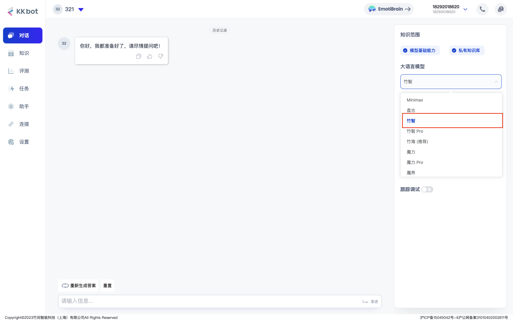
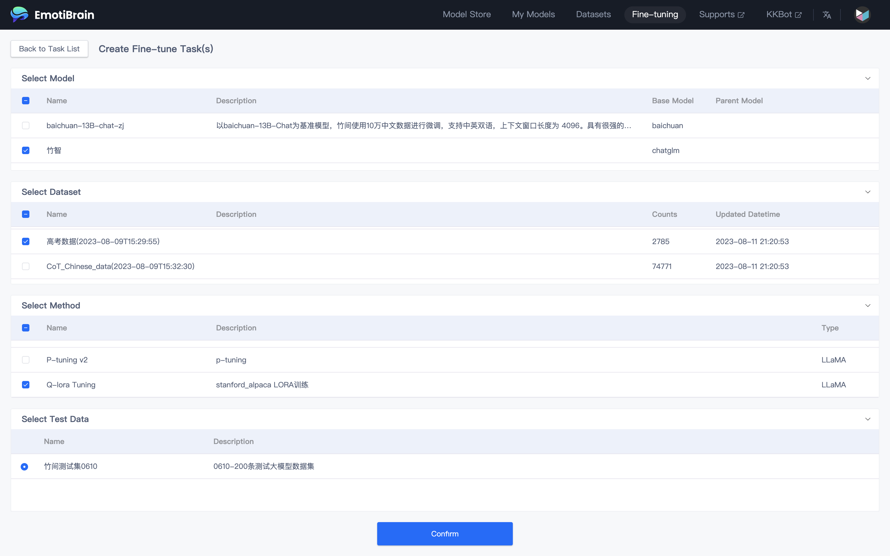
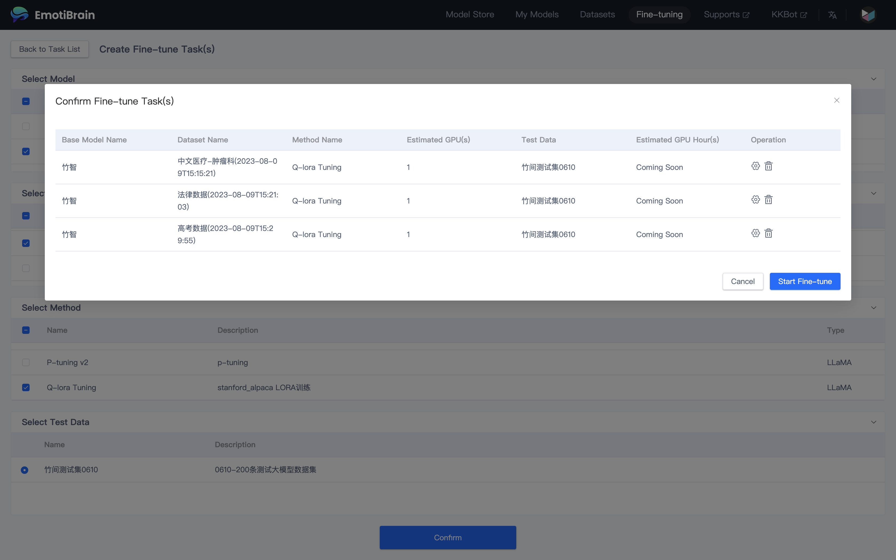

# README

# Zhuzhi-6B

[Hugging Face](https://huggingface.co/emotibot-inc/Zhuzhi-6B) | [GitHub](https://github.com/emotibot-inc/Zhuzhi-6B) | [Model Scope](https://modelscope.cn/models/emotibotinc/Zhuzhi-6B/summary)

# **模型介绍**

竹智是由竹间智能使用中英文对话数据微调的中英双语对话模型。训练时基本上沿袭官方的多轮对话数据组织格式，具有对话流畅、部署门槛较低等众多优秀特性：

- 较长的上下文：在对话阶段使用 8K 的上下文长度训练。
- 更高效的推理：在 INT4 量化下，6G 显存支持的对话长度由 1K 提升到了 8K，推理速度也有较大的提升。

# **推理对话**

您可以直接注册并登录竹间智能科技发布的大模型产品 [Emotibrain](https://brain.emotibot.com/?source=zhuzhi6b_github)，并选择 **CoPilot**（**KKBot**） 进行的在线测试，注册即可立即使用；

# **模型训练**

您可以直接注册并登录竹间智能科技发布的大模型产品 [Emotibrain](https://brain.emotibot.com/?source=zhuzhi6b_github)，并选择 Fine-tune 进行 **0 代码微调**，注册即可立即使用；

详细的训练流程您可以浏览此文档：[Emotibrain 快速入门](https://brain.emotibot.com/supports/model-factory/dash-into.html)（大约 5 分钟）

# **更多信息**

若您想了解更多 大模型训练平台 的相关信息，请访问 [Emotibrain 官网](https://brain.emotibot.com/?source=zhuzhi6b_github) 进行了解；